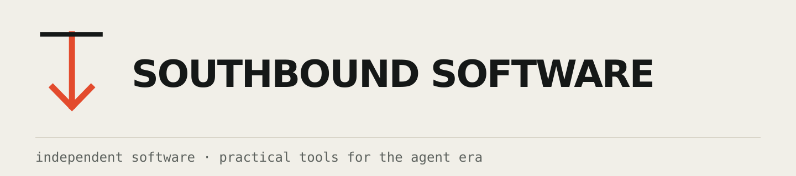

  <picture>
    <source media="(prefers-color-scheme: dark)" srcset="./assets/header-dark.svg" />
    
  </picture>

I'm Tyler. My background is in IT and cybersecurity. I use AI to turn technical problems into local-first, open-source software.

## Toolport

[Toolport](https://github.com/tsouth89/toolport) is my main project. It gives AI clients one place to find and use MCP tools, keeps credentials on your machine, and avoids loading every tool definition into every request.

[Website](https://toolport.app) · [Downloads](https://github.com/tsouth89/toolport/releases/latest) · [Source](https://github.com/tsouth89/toolport)

## Omarchy

Outside Toolport, most of my current work is built for or around Omarchy, which is my daily driver. I make the tools I want in my own setup and release them as open source.

My current work is in the pinned repositories below. Everything is free and open source.

## Links

[btso.dev](https://btso.dev) · [Sponsor](https://github.com/sponsors/tsouth89) · [Email](mailto:tyler@btso.dev)
