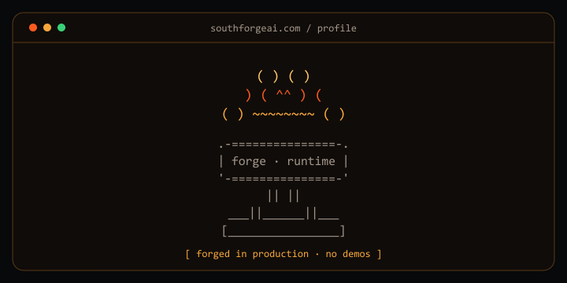

<div align="center">
  
</div>

```text
> founder @ southforge ai
> building practical tools for the agent era
> status: shipping
```

I build local-first developer tools and small, useful software—focused on clear
interfaces, strong defaults, and less operational drag.

### /current_work

- [Toolport](https://github.com/tsouth89/toolport) — local-first MCP gateway with lazy discovery and integrity controls.
- [Burnwatch](https://github.com/tsouth89/burnwatch-sdk) — observe-only spend monitoring for autonomous AI agents.
- [LimitWatch](https://github.com/tsouth89/limitwatch) — source-linked tracking for AI subscription limits.

### /links

[southforgeai.com](https://southforgeai.com)
